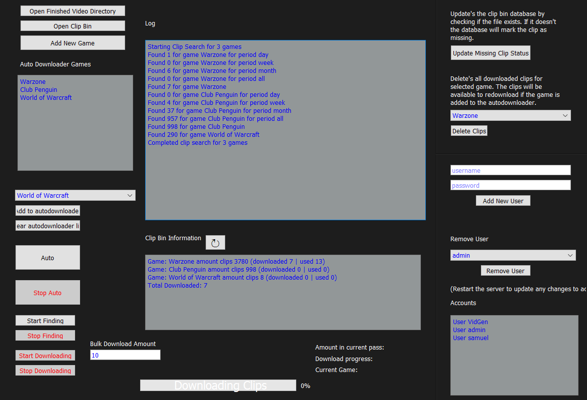

## **HA6Bot’s Twitch Clip Compilation Generator**

The **TCCG** is a system of bots that **collects clips automatically**, lets you edit videos by **cutting and combining these clips**, and puts them **together into a compilation video** ready to be uploaded straight to any social media platform. **Full VPS support is provided**, along with an accounts system so multiple users can use the bot at once.

Compilation videos can be found in nearly **all** corners of the internet - YouTube, Facebook, Twitter, Instagram. The most common forms are **gaming compilations**. There are many different styles of gaming compilations that can be made. **Top clips, wins, fails, wtf moments, glitches, funny moments** etc. They wrack up a lot of views and can **quickly grow** a channels follower base, especially when a new game is released. However there are several challenges involved in creating compilation videos. This bot (or series of programs) addresses many of these issues.

This bot is split up into three separate programs. **The server. The client. The video generator.** These programs perform different functions that when combined creates a very powerful system for **auto generating compilation videos**.

Preview:

[Valorant Top 50 Plays Video](https://www.youtube.com/watch?v=6KfIjJeYU3s&feature=youtu.be)

[GTA 5 Fails and Funny moments ](https://www.youtube.com/watch?v=6KfIjJeYU3s&feature=youtu.be)

## **What this bot does.**

[Video of TCCG in use](https://youtu.be/ucUcux0kta8)

1.	Passively downloads and stores top highlight clips from Twitch for any category/categories. The clips are automatically kept track of in a clip bin database. 
2.	Provides a video editor interface connected directly to the clip bin database, allowing you to easily go through the clips. The interface is somewhat similar to that of tinder, where you can keep/skip a video clip. You can also trim the clips and change their volume.
3.	A video generator that compiles the clips from the video editor, generating a mp4 video where that you can upload to any platform.

One of the main challenges of creating compilation videos is finding the video clips in the first place. This can be a laborious task and is a large factor for the time to edit the videos. This bot will **automatically find and download clips for you straight from Twitch**. They come from the top clips category and therefore are somewhat guaranteed to be of good quality. Of course it’s not perfect. Sometimes streamers will have the wrong gaming category selected when their clip gets highlighted or duplicates of clips occur where multiple users highlighted the same clip. Either way it is still more streamlined then doing it manually. 
Full VPS Support and Account System

Since the bot is split up into three different programs, communications between the programs uses a **combination HTTP and FTP servers** to move information from one program to the other. The FTP servers are used to move mp4 files around while the HTTP servers are for general information and usually are in the form of json. FTP requires authorisation for each client and therefore this provides the basis of the account system. You can add or remove users and set there password in the server program. This username and password combination is required in the video editor program. Therefore this works perfectly for a multi man operation as allows for multiple people to use the bot at once. 

## There are three separate programs that make up TCCG.

1.	Server Program
Function:
•	Automatically downloads clips from Twitch top highlights for any categories that you select.
•	Can manage accounts for the client logins

2.	Video Editor Program

This is the actual user interface used to browse the clips in the server clip bin, and also make edits to them in preparation for their compilation. This is a fairly simple process, for any one clip you have the option to keep or remove it; trim the start and end of it; change the volume. You can also upload an intro/outro/interval/general clip. There are also music options for the background music of each video. 

3.	Video Generator Program
This actually puts together the clips into a compilation video. If a interval is specified, it will put a interval between every clip. The same goes for the intro and outro. It also generates a credits text file with links to the streamers channel for the video.

## Automatic Downloader Notes

The automatic downloader side of the server is designed in a way to get around the Twitch limitations for getting the highlight clips. 
It is split into two different processes:
1.	Finding the top highlight clips and obtaining it’s URL
2.	Downloading the clip via the URL

There are no restrictions on downloading the clips and this is simple to do once a URL is obtained. However finding the top clips in the first place is another story.

To find the clips the bot uses the following API call:

    https://api.twitch.tv/kraken/clips/top?game={game_name}&period={period}&language=en&limit={100}&cursor={next_page_cursor}

We use kraken because it gives access to many more clips then helix - from experience about 4x as much.

Twitch only gives you access to about 1000 clips for each time period entered into the API call, as it limits the amount of pages you can use in the pagination call to about 10 pages, at a max of 100 clips per page. There are four time periods “day”, “week”, “month”, “all”. Therefore at any one time you can only get 4000 clips if every single page is used. This would not be a sufficient amount of clips if the find/download process is only initiated when the bot is used for video editing. Therefore it is recommended to run this process automatically to build up a large clip bin, preferably on a VPS. This is largely down to the usage of the bot - heavy usage will demand a large amount of clips, and therefore turning on the automated find/download process is recommended for this case. 

## Assets

**Music**

While most of the assets you'll have to create for yourself, I can provide some copyright free "epic" music to get you started. There's 25 of the best copyright free epic music found regularly in "top clips/plays" videos, with the volumes adjusted to a similar level. Simply drag the "Epic" folder into the video generator Assets/Music/ folder and restart it. This will register the new music category in the server so that the client can now select it when editing a video.

There's also the option of choosing "None" for the music category when editing a video. This will force generate the video without any music.

[Epic Music (25 copyright free songs)](https://www.mediafire.com/file/x3zszb11lihvbnd/TCCG_Epic_Music_Assets.zip/file)

**Video Files**
Video files can be manually uploaded into the bot for four different purposes:

 1. As a introduction video
 2. As a interval (transition) video
 3. As a outro video
 4. As a "first clip" video

The selection of these video files is done in the video editor client. The selection of *1, 2, 3*  can be saved so that you do not have to reselect them each time. The video files must be 1920x1080p otherwise the video editor will not allow you to select them.

These files should be placed into the following folders in the video editor client directory.

 - Outros
 - FirstClips
 - Intros
 - Outros

These folders will be generated when the video editor client is run.

You can also generate a video without any manually uploaded video files. See below for the client config file options:`enforce_interval`,`enforce_intro`,`enforce_outro`,`enforce_firstclip`

**Fonts**
This is for the subtitle of the streamer's name. The streamer's name will appear in the top left of each clip. You can change the font of this text by changing the value of `fontname`in the video generator config file. The value should be the name of any font installed on your system.   

## Setting up the system

## Database breakdown: (twitchclipdb)

Table clip_bin

`clip_num` : iterator

`game` : What Twitch category the clip belongs to

`clip_id` : Unique id for clip provided by Twitch

`date`: Date when clip recorded

`clipwrapper`: clip’s TwitchClipWrapper() from scriptwrapper.py

`status`: The status of the clip
•	FOUND = information found about clip but not downloaded yet.
•	DOWNLOADED = Clip downloaded and ready for editing
•	USED = Used in video (mp4 file has been deleted)
•	MISSING = Can occur after “Update Missing Status” clicked. Clips with status previously marked as DOWNLOADED, but mp4 cannot be found will be marked as MISSING.

Table saved_games

`num` : iterator

`game_name` : The category name as it appears on Twitch

`game_id` : The id of the category

___

## File Breakdown

Server

`main.py` : start point

`database.py` : all the sql queries are written here

`server.py` : FTP and HTTP Servers are handled here.

`settings.py` : Data loaded in from config.ini

`twitch.py` : Where the API calls are made to Twitch with the download/find methods.

`autodownloader.py` : A wrapper for the download/find process utilised in autodownloaderUI.py

`autodownloaderUI.py` : Where the UI is programmed

`scriptwrapper.py` : Various wrappers for the twitch clips here. Formatting of the video occurs here in the `reformatPartialJson` method

Client

`main.py` : start point

`client.py` : Communications with the server http and ftp occur here

`settings.py` : Data loaded in from config.ini

`scriptwrapper.py` : Various wrappers for twitch clips / entire videos are stored here

`clientUI.py` : Where the UI is programmed

Video Generator

`main.py` : start point

`server.py` : FTP and HTTP Servers are handled here.

`settings.py` : Data loaded in from config.ini

`scriptwrapper.py` : Various wrappers for twitch clips / entire videos are stored here

`vidGen.py` : Methods for video rendering here see `renderVideo`

`vidgenUI.py` : Where the UI is programmed

___

Setup the programs in the following order:

1. Server
2. Client
3. Video Generator

## Config settings:

Each program has it's own config file that **MUST** be configured appropriately for the system to function properly. **Each bot will generate a config file** (so 3 in total) once it is ran from it's **start point file**. Once the config file is generated, fill in the details where necessary then **restart** the bot and the changes will be taken into account. 

**Server config**

[server_details]

`address` = 127.0.0.1 <-- Server Address

`http_port` = 8000  <-- Server HTTP Port

`ftp_port` = 2121 <-- Server FTP Port

[video_generator_location]

`address` = 127.0.0.1 <-- Video Generator Address

`http_port` = 8001 <--Video Generator HTTP Port

`ftp_port` = 2122 <-- Video Generator FTP Port

`ftp_user` = VidGen <-- Video Generator FTP Client name

`ftp_password` = password <-- Video Generator FTP Client password

[twitch_settings]

`language` = en <-- Clip language

`client_id` =  <-- Twitch API Client ID

`bearer` = <-- Twitch API Bearer

[mysql_database]

`databasehost` = localhost <-- MySQL Server address

`databaseuser` = root <-- MySQL Server user

`databasepassword` = <-- MySQL Server user password

**Video editor client config**

[server_location]

`address` = 127.0.0.1 <-- Server address

`server_http_port` = 8000 <-- Server HTTP port

`server_ftp_port` = 2121 <-- Server FTP port

[auto_login]

`username` = admin <-- User registered in server

`password` = password <-- User registered in server’s password

`auto_login` = true <-- Insert the above details into the login window on startup

[video_settings]

`enforce_interval` = True <-- Forces you to select a interval for your video

`enforce_intro` = True <-- Forces you to select a intro for your video

`enforce_outro` = True <-- Forces you to select a outro for your video

`enforce_firstclip` = True <-- Forces you to select a first clip for your video

**Video Generator config file**

[video_generator_details]

`address` = 127.0.0.1 <-- Video Generator Address

`http_port` = 8001 <-- Video Generator HTTP port

`ftp_port` = 2122 <-- Video Generator FTP port

`ftp_user` = VidGen <-- Video Generator FTP user

`ftp_password` = password <-- Video Generator FTP user’s password

[server_location]

`address` = 127.0.0.1 <-- Server address

`http_port` = 8000 <-- Server HTTP port

`ftp_port` = 2121 <-- Server FTP port

[rendering]

`fps` = 30 <-- FPS to render video at

`fontname` = Gilroy-ExtraBold <-- Font for streamers name. (Must be installed on system)

`streamer_name` = true <-- Include the streamer name in the video

___

## Dependencies.

FFMPEG is required for the Video Generator Program. (must be added to system path so can be called from command line)

A MySQL server is required for the Server program.

Python (recommend 3.7+ and 64bit on windows)

Twitch API credentials (client_id and bearer)

Module list

 - requests
 - PyQt5
 - Pymediainfo
 - Opencv-python
 - Moviepy
 - Pyftpdlib
 - Pysubs2
 - Pydub
 - mysql
